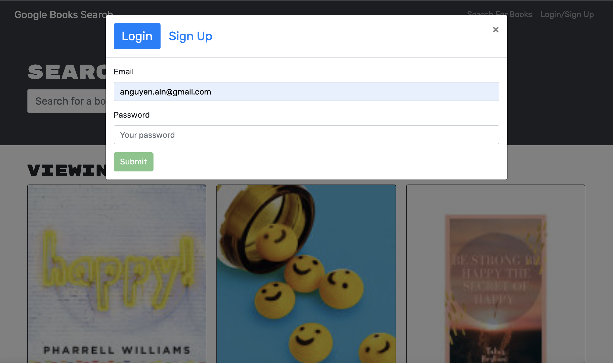

# Book-Search-Engine

https://github.com/johntannous/book-search-engine

## Description
This application is for the bookworm in all of us. The backend of this application is don with a RESTful API and refactored to a GraphQL APIand built with an Apollo server. The app as a whole was built using the MERN stack with REACT front end, MongoDB database, and Node.js/Express.js server and API. .
## Table of Contents
  
* [License](#license)
* [Installation](#installation)
* [Usage](#usage)
* [Questions](#questions)
  

## License
    This project is licensed under the MIT license. 
  
## Installation
     Run 'npm install' in the command line to install all the necessary dependencies if trying to run the app locally.

## Usage
    To access this application download the code and run 'npm start' in the root of the directory. Then open Heroku and follow the route paths in the routes directory to store data in the database.

## Questions
  My GitHub profile link is: https://github.com/johntannous.
  If you have any questions regarding this app, please contact directly at: john.tannous97@gmail.com.
  

